# 🪑Tapyta Furniture

Tapyta Furniture adalah aplikasi e-commerce berbasis PHP yang dirancang untuk menjual furnitur secara online. Aplikasi ini memiliki fitur lengkap untuk pengguna dan admin, termasuk browsing produk, keranjang belanja, checkout, pembayaran, serta manajemen produk, pesanan, pelanggan, dan FAQ.

> Dibuat saat semester 4 sebagai proyek pembelajaran.

## 🌟Fitur Utama

### 🛍️Frontend

- Halaman produk, detail produk, keranjang belanja, checkout, dan pembayaran.
- Halaman statis seperti _About Us_, _Contact_, dan _Privacy Policy_.
- Sistem login dan registrasi pengguna.

### ⚙️Backend (Admin Panel)

- Manajemen produk, kategori, pelanggan, pesanan, dan FAQ.
- Statistik pesanan, pendapatan, dan pengguna.
- Fitur ekspor dan impor database.

### 🧰Teknologi yang Digunakan

- **PHP**: Untuk logika aplikasi dan koneksi database.
- **MySQL/MariaDB**: Untuk penyimpanan data.
- **JavaScript**: Untuk grafik statistik (menggunakan Chart.js) dan interaktivitas.
- **HTML/CSS**: Untuk tampilan frontend.
- **Bootstrap**: Untuk desain responsif.

## 📁Struktur Folder

- `index.php`: Entry point aplikasi.
- `views/`: Folder tampilan untuk frontend.
- `views/admin/`: Folder tampilan untuk admin panel.
- `router.php`: File untuk routing custom.
- `uploads/`: Folder untuk menyimpan gambar produk.
- `.htaccess`: File untuk URL rewriting.

## 🖼️Screenshot Hasil Website

### 📝 Register

<table>
  <tr>
    <td>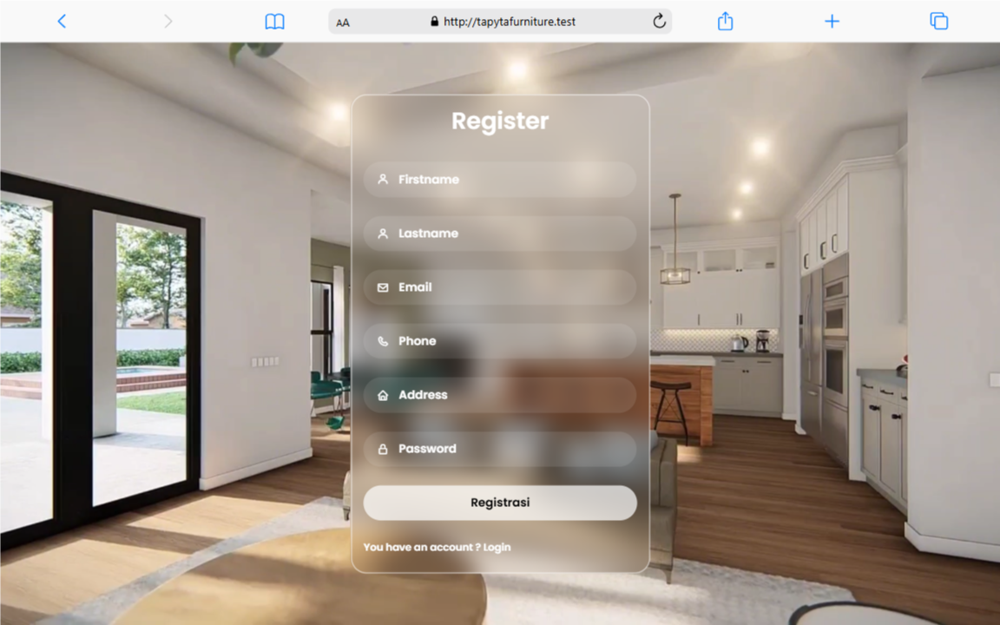</td>
  </tr>
</table>

### 🔑 Login

<table>
  <tr>
    <td>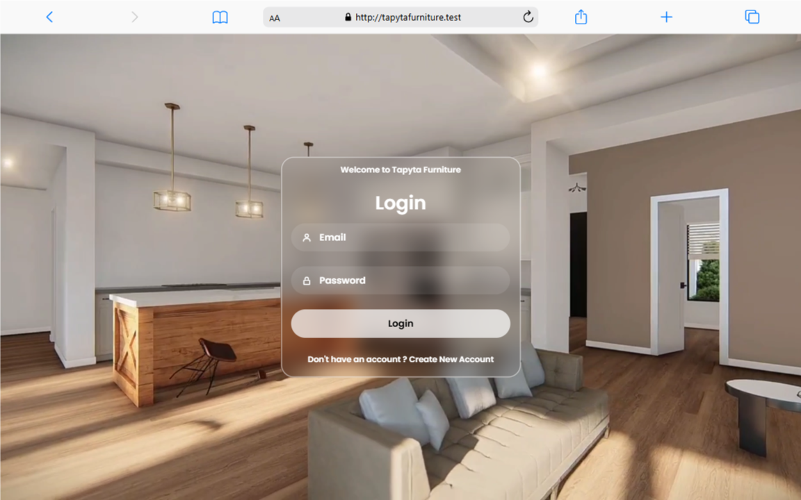</td>
  </tr>
</table>

### 👤 Profil

<table>
  <tr>
    <td>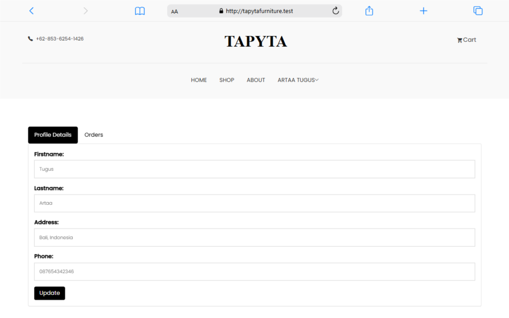</td>
    <td>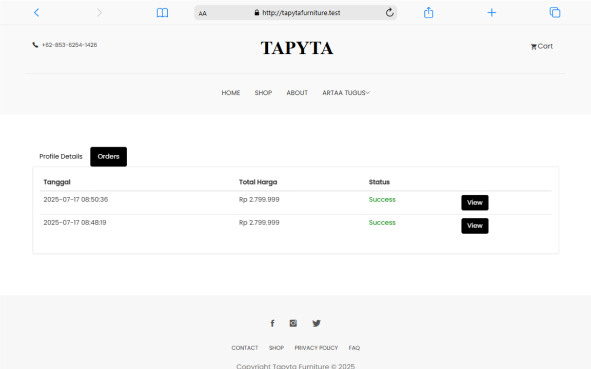</td>
  </tr>
</table>

### 🏠 Tapyta (Homepage & Fitur)

<table>
  <tr>
    <td>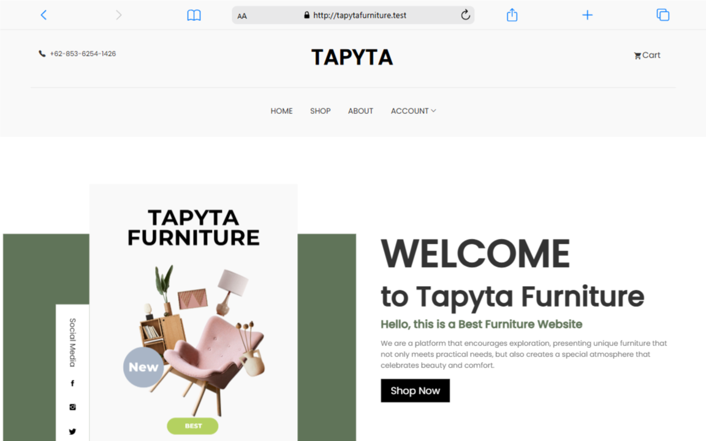</td>
    <td>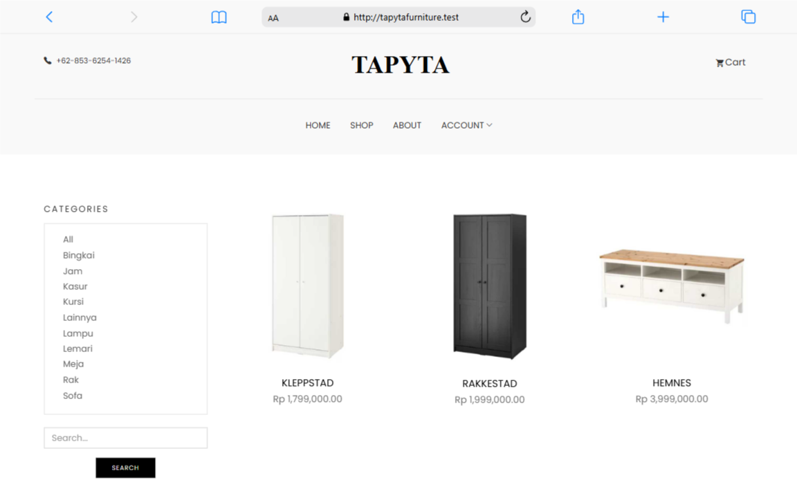</td>
  </tr>
  <tr>
    <td>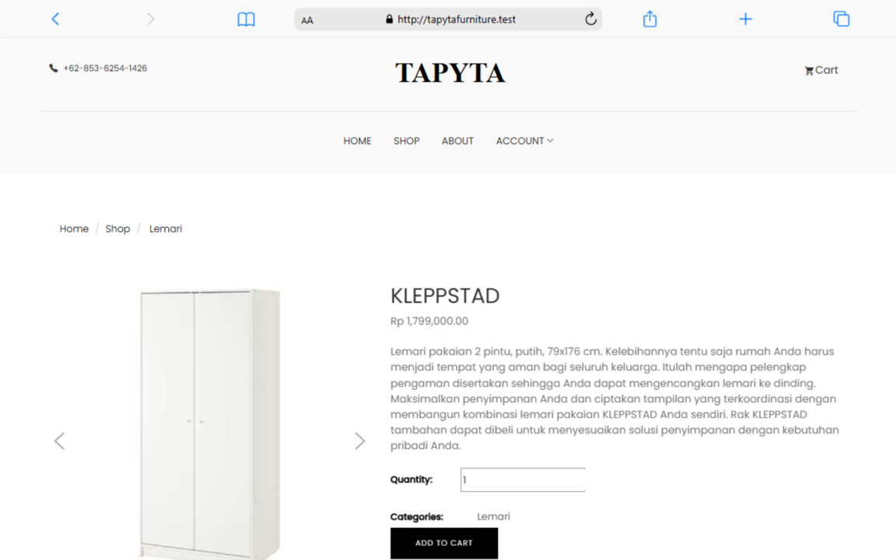</td>
    <td></td>
  </tr>
  <tr>
    <td>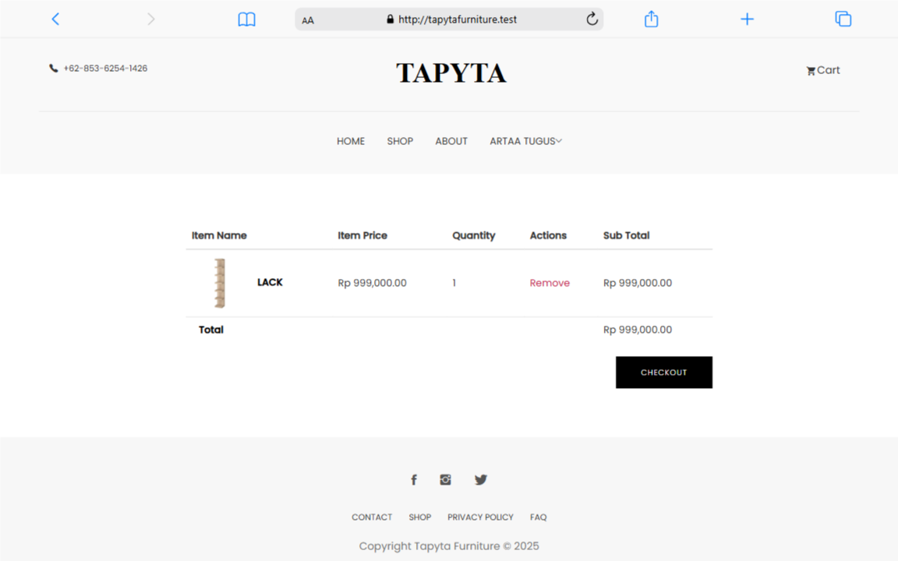</td>
    <td>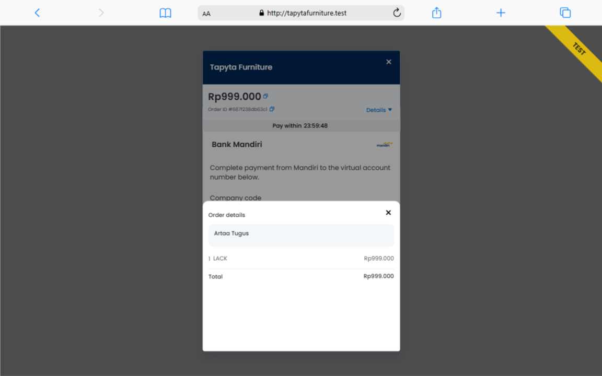</td>
  </tr>
  <tr>
    <td>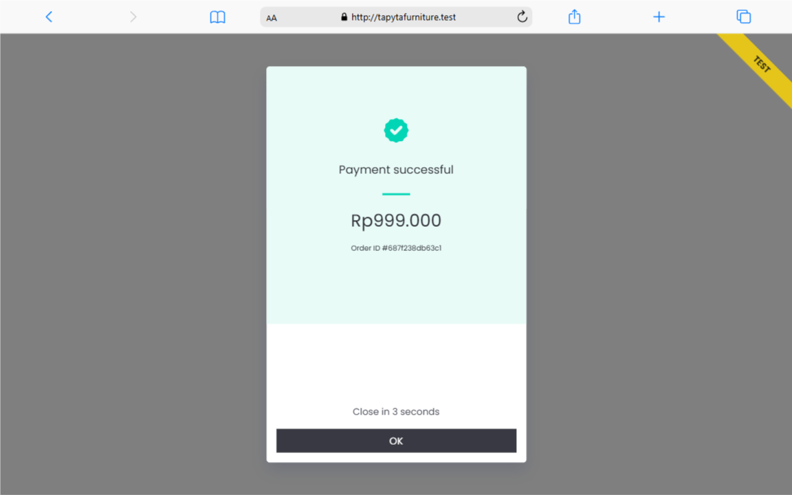</td>
    <td></td>
  </tr>
</table>

### 🎛️ Admin

<table>
  <tr>
    <td>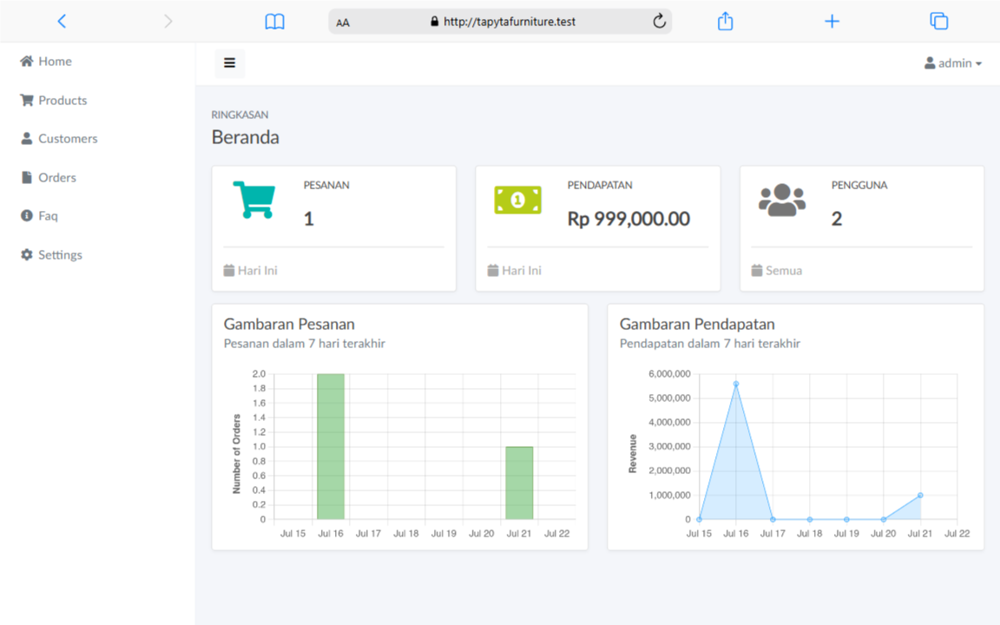</td>
    <td>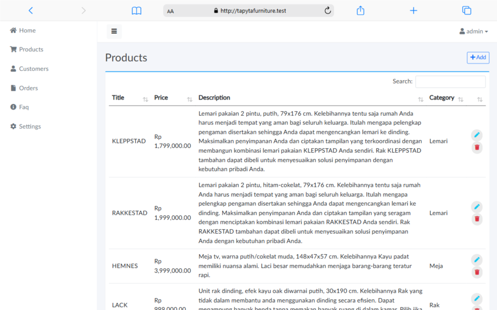</td>
  </tr>
  <tr>
    <td>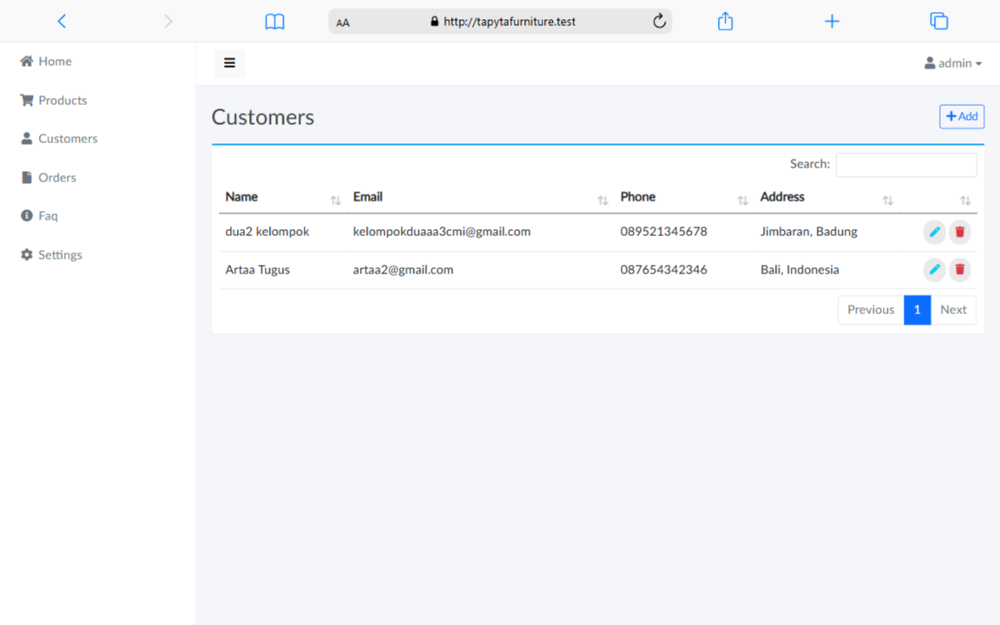</td>
    <td>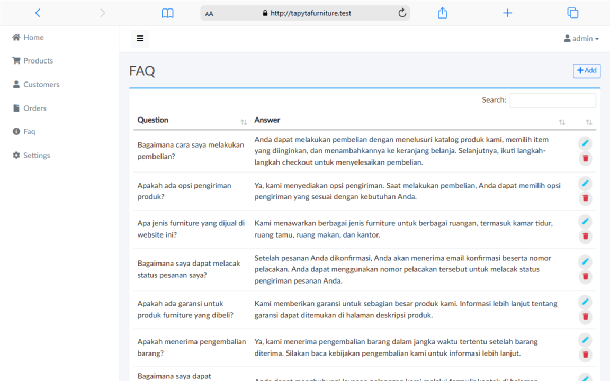</td>
  </tr>
  <tr>
    <td>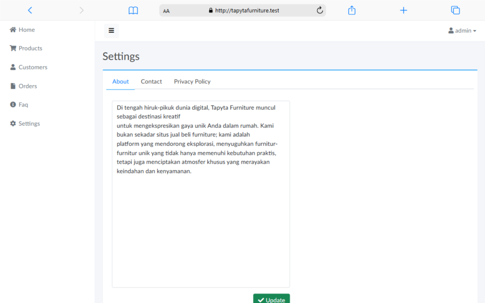</td>
    <td></td>
  </tr>
</table>
