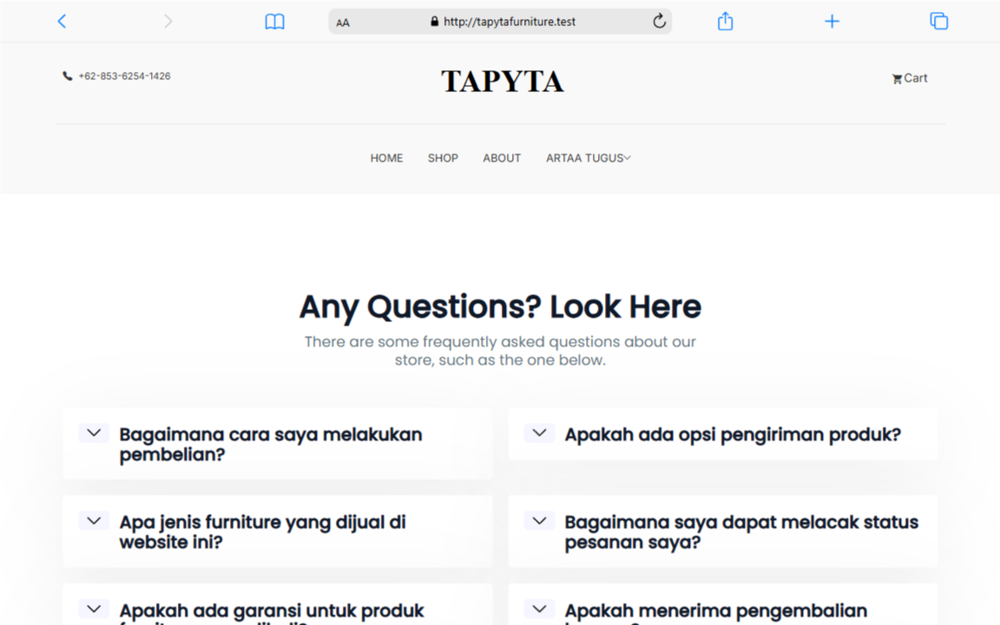

# Tapyta Furniture

Tapyta Furniture adalah aplikasi e-commerce berbasis PHP yang dirancang untuk menjual furnitur secara online. Aplikasi ini memiliki fitur lengkap untuk pengguna dan admin, termasuk browsing produk, keranjang belanja, checkout, pembayaran, serta manajemen produk, pesanan, pelanggan, dan FAQ.

---

## Fitur Utama

### Frontend

- Halaman produk, detail produk, keranjang belanja, checkout, dan pembayaran.
- Halaman statis seperti _About Us_, _Contact_, dan _Privacy Policy_.
- Sistem login dan registrasi pengguna.

### Backend (Admin Panel)

- Manajemen produk, kategori, pelanggan, pesanan, dan FAQ.
- Statistik pesanan, pendapatan, dan pengguna.
- Fitur ekspor dan impor database.

### Teknologi yang Digunakan

- **PHP**: Untuk logika aplikasi dan koneksi database.
- **MySQL/MariaDB**: Untuk penyimpanan data.
- **JavaScript**: Untuk grafik statistik (menggunakan Chart.js) dan interaktivitas.
- **HTML/CSS**: Untuk tampilan frontend.
- **Bootstrap**: Untuk desain responsif.

---

## Cara Menjalankan

### Prasyarat

- PHP (minimal versi 7.x)
- MySQL/MariaDB
- Web server (Apache/Laragon/XAMPP)
- Composer (untuk mengelola dependensi PHP)

### Langkah-Langkah

1. **Clone Repository**

   ```bash
   git clone https://github.com/username/TapytaFurniture.git
   cd TapytaFurniture
   ```

2. **Install Dependensi**

   - Jalankan perintah berikut untuk mengunduh dependensi PHP:
     ```bash
     composer install
     ```

3. **Setup Database**

   - Buat database dengan nama `db_TapytaFurniture2`.
   - Import file SQL jika tersedia.

4. **Konfigurasi Koneksi Database**

   - Edit file `views/db.php` untuk menyesuaikan host, nama database, username, dan password.

5. **Jalankan Web Server**
   - Pastikan folder project berada di root web server (misal: `c:\laragon\www\TapytaFurniture`).
   - Akses di browser:
     ```
     http://localhost/TapytaFurniture/
     ```

---

## Struktur Folder

- `index.php`: Entry point aplikasi.
- `views/`: Folder tampilan untuk frontend.
- `views/admin/`: Folder tampilan untuk admin panel.
- `router.php`: File untuk routing custom.
- `uploads/`: Folder untuk menyimpan gambar produk.
- `.htaccess`: File untuk URL rewriting.

---

## Catatan Penting

- Pastikan modul `mod_rewrite` aktif di Apache untuk mendukung URL rewriting.
- Folder `vendor/` tidak diupload ke repository. Anda harus menjalankan `composer install` untuk mengunduh dependensi.
- Jika ada masalah saat menjalankan project, periksa konfigurasi database dan file `.htaccess`.

---

## Screenshot Hasil Website

Berikut adalah tampilan halaman-halaman utama aplikasi:

### 1. Halaman Register


### 2. Halaman Login


### 3. Halaman Profil


### 4. Halaman Utama Tapyta





### 5. Halaman Admin Panel


---

Jika ada pertanyaan atau masalah, silakan hubungi [email@example.com](mailto:email@example.com).
